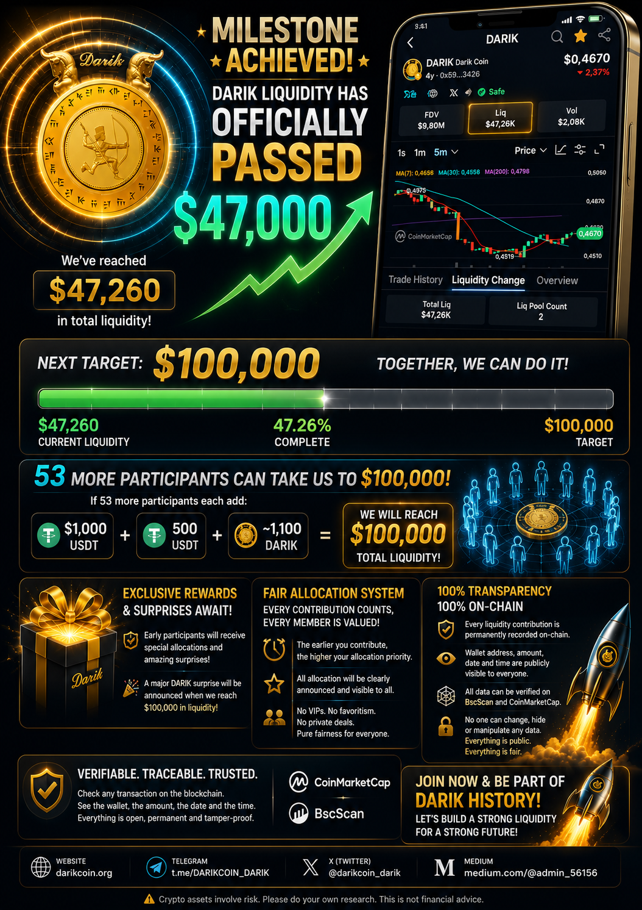
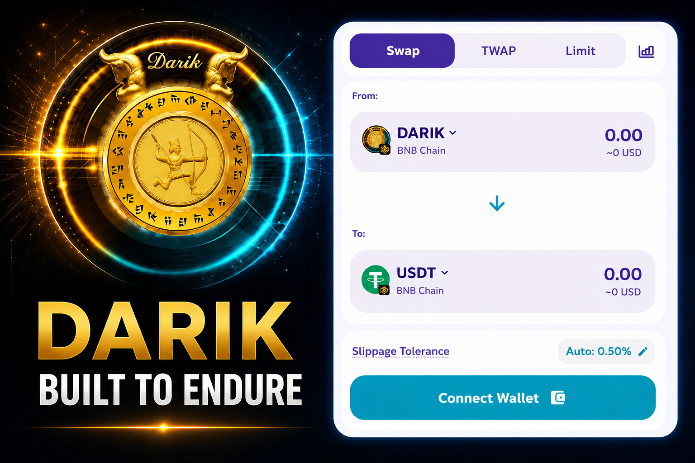

# Darik

Official repository for the Darik ecosystem.

## Official Links

Website
https://darikcoin.org

Whitepaper
https://darikcoin.org/DARIK_ECOSYSTEM_WHITEPAPER.pdf

CoinMarketCap
https://coinmarketcap.com/currencies/darik/

GitHub
https://github.com/darik-coin/Darik

Telegram
https://t.me/DARIKCOIN_DARIK

X (Twitter)
https://x.com/darikcoin_darik

Medium
https://medium.com/@admin_56156

Instagram
https://www.instagram.com/darikcoin.io

## Latest News

### 🚀 DARIK Liquidity Surpasses $437,000 as BscScan Market Data Goes Live

DARIK has officially surpassed **$437,000 in liquidity**, marking another significant milestone in the continued growth of the ecosystem.

At the same time, another important achievement has been completed.

Following extensive coordination and technical updates, **DARIK's market data, including price and market value, is now displayed on BscScan**, providing greater transparency and easier access to key market information for users and investors.

These developments represent another important step toward strengthening the DARIK ecosystem and expanding its public infrastructure.

### Liquidity Expansion Program

Participants who contribute:

- **1,000 USDT**
- **An equivalent value of 1,000 USDT in DARIK**

(approximately **$2,000 total liquidity contribution**)

will become eligible for the **DARIK Allocation Program** when liquidity reaches **$2,000,000**.

The required amount of DARIK depends on the market price at the time of participation.

### Read the Full Article

https://medium.com/@admin_56156/darik-liquidity-surpasses-437-000-as-bscscan-market-data-goes-live-f7a423f7dc23

---

### Official Links

- Website: https://darikcoin.org
- Whitepaper: https://darikcoin.org/DARIK_ECOSYSTEM_WHITEPAPER.pdf
- CoinMarketCap: https://coinmarketcap.com/currencies/darik/
- BscScan: https://bscscan.com/token/0x595a67d180bae10314384265d56927c8ff073426
- Telegram: https://t.me/DARIKCOIN_DARIK
- X: https://x.com/darikcoin_darik
- Medium: https://medium.com/@admin_56156

### 🚀 DARIK Liquidity Surpasses $397,000 — Final Preparations for a Major Ecosystem Announcement

DARIK has officially surpassed **$397,000 in liquidity**, marking another significant milestone in the continued growth of the ecosystem.

The journey toward the **$2,000,000 liquidity milestone** continues with strong momentum.

The DARIK team is currently completing the final technical and operational preparations for a major ecosystem announcement.

Rather than releasing incomplete information, every component is being finalized to ensure the highest level of quality, reliability, and transparency.

The announcement will be released in the coming days.

### Liquidity Expansion Program

Participants who contribute:

- **1,000 USDT**
- **An equivalent value of 1,000 USDT in DARIK**

(approximately **$2,000 total liquidity contribution**)

will become eligible for the **DARIK Allocation Program** when liquidity reaches **$2,000,000**.

The required amount of DARIK depends on the market price at the time of participation.

### Read the Full Article

https://medium.com/@admin_56156/darik-liquidity-surpasses-397-000-final-preparations-for-a-major-ecosystem-announcement-be1fdad41899

---

**Official Links**

Website: https://darikcoin.org

CoinMarketCap: https://coinmarketcap.com/currencies/darik/

BscScan: https://bscscan.com/token/0x595a67d180bae10314384265d56927c8ff073426

Telegram: https://t.me/DARIKCOIN_DARIK

X: https://x.com/darikcoin_darik

### 🚀 DARIK Liquidity Surpasses $360,000 — A Big Surprise Is Coming

DARIK has achieved another important milestone as liquidity has officially surpassed **$360,000**.

The journey toward the next major target of **$2,000,000 liquidity** continues.

🔥 A major surprise announcement is planned by the end of this week.

The DARIK ecosystem continues to expand with a focus on:

✅ Transparency  
✅ Community growth  
✅ Real on-chain progress  
✅ Long-term ecosystem development  

All liquidity growth and activities remain fully transparent and verifiable on the blockchain.

📖 Medium Article:
https://medium.com/@admin_56156/darik-liquidity-surpasses-360-000-the-journey-toward-2-million-begins-559d06fb4b08

Stay tuned — something big is coming 🚀

### 🚀 90,000 DARIK Successfully Distributed — DARIK Holders Approach 100,000

A major milestone has been achieved for the DARIK ecosystem.

90,000 DARIK have been successfully distributed to 90,000 carefully verified wallets. Wallets identified as exchanges or obvious bot activity were excluded to help ensure a healthy and genuine community distribution.

The market response has been exceptional. Despite this large-scale distribution, DARIK maintained strong momentum and advanced from approximately **$0.33 to above $1.00**, while trading activity increased significantly.

This result demonstrates the strength of the DARIK community and growing market confidence.

Following this milestone, the number of DARIK holders is now approaching **100,000**.

📖 Medium Article:

https://medium.com/@admin_56156/90-000-darik-successfully-distributed-darik-holders-approach-100-000-as-the-surprise-3ee76e9519ab

🌐 Official Website:

https://darikcoin.org/

📊 CoinMarketCap:

https://coinmarketcap.com/currencies/darik/

🔍 BscScan:

https://bscscan.com/token/0x595a67d180bae10314384265d56927c8ff073426

🎯 The countdown continues...

**The next major surprise announcement is coming soon.**

### DARIK Announces Major Decentralization Initiative

DARIK liquidity has officially surpassed $111,000.

A total of 17,850,000 DARIK has been designated for the Community Allocation Program as part of DARIK's long-term decentralization strategy.

📄 Medium Article:
https://medium.com/@admin_56156/darik-announces-major-decentralization-initiative-with-17-85-90e7273cd3e3

📑 Allocation Schedule:
https://github.com/darik-coin/Darik/blob/main/DARIK_Community_Allocation_Schedule-1.pdf

👥 Holder List:
https://bscscan.com/token/0x595a67d180bae10314384265d56927c8ff073426#balances

### DARIK Liquidity Surpasses $91,000 — Only 9 Allocation Spots Remain Before the $100,000 Milestone

DARIK liquidity has officially surpassed **$91,000**, bringing the project to **91% of its $100,000 liquidity target**.

Only **9 allocation spots remain** before the current allocation eligibility program reaches full capacity.

Participants who wish to qualify may add liquidity with a total value of approximately **$1,000**, consisting of:

* 500 USDT
* Approximately 1,050 DARIK (depending on market price)

### Important

Allocation eligibility is available only for qualifying participants who complete their liquidity contribution **before total liquidity reaches $100,000**.

Once the $100,000 liquidity milestone is achieved:

* No new allocation spots will be available
* No extensions will be granted
* No exceptions will be made
* Liquidity added afterward will not qualify for the current allocation program

### Community Update

A special announcement will be revealed when DARIK reaches the $100,000 liquidity milestone.

We invite all community members to join the discussion and follow the latest updates:

Medium:
https://medium.com/@admin_56156/darik-liquidity-surpasses-91-000-only-9-allocation-spots-remain-before-the-100-000-milestone-7f48c6a081a7

Reddit:
https://www.reddit.com/u/Darik-Coin/s/IJQilCETrX

Current Liquidity: **$91,000+**

Remaining Allocation Spots: **9**

---

### DARIK Liquidity Surpasses $81,000 — Only 19 Allocation Spots Remain Before $100,000
DARIK liquidity has officially surpassed **$81,000**, marking another major milestone on the journey toward the next target of **$100,000** in total liquidity.

Only **19 allocation spots remain** before the current allocation program reaches its final capacity.

To qualify, participants add liquidity with a total value of approximately **$1,000**, consisting of:

- 500 USDT
- Approximately 1,050 DARIK (depending on the current DARIK market price)

### Important

Allocation eligibility is available only for participants who add qualifying liquidity **before total liquidity reaches $100,000**.

Once the liquidity milestone of **$100,000** is achieved:

- No new allocation spots will be created
- No extensions will be granted
- Additional liquidity added after $100,000 will not qualify for allocation eligibility

### Looking Ahead

A special community announcement will be revealed when DARIK reaches the **$100,000 liquidity milestone**.

All liquidity contributions remain publicly visible and verifiable on-chain, reflecting DARIK's commitment to transparency and community-driven growth.

Current Liquidity: **$81,000+**

Next Target: **$100,000**

Remaining Allocation Capacity: **19 Participants**

### DARIK Liquidity Surpasses $63,000 — Limited Allocation Eligibility Remains Before $100,000

DARIK liquidity has now surpassed $63,000 and continues to grow through transparent on-chain participation.

The next major milestone remains $100,000 in total liquidity.

To qualify for the upcoming allocation program, participants must add approximately:

- 500 USDT
- DARIK tokens of equal value (approximately 1,100 DARIK depending on market price)

for a total liquidity contribution of around $1,000.

Eligibility is available only before the liquidity target of $100,000 is reached.

Once the available participation capacity is completed and liquidity reaches $100,000, no additional allocation eligibility will be granted.

All qualifying liquidity additions are publicly visible and independently verifiable on-chain.

Website:
https://darikcoin.org

Medium:
https://medium.com/@admin_56156

CoinMarketCap:
https://coinmarketcap.com/currencies/darik/

---

### DARIK Liquidity Surpasses $58,000 — Only 42 Participation Slots Remain Before $100,000

DARIK liquidity has officially surpassed $58,000 and reached approximately $58,280.

The next major milestone is $100,000 in total liquidity.

Only 42 participation slots remain before the target is achieved.

Each qualifying participant contributes:

- 1,000 USDT
- 500 USDT
- Approximately 1,100 DARIK

All qualifying liquidity contributions are publicly verifiable on-chain.

Once total liquidity reaches $100,000, no additional participation slots will be available.

No extensions.
No exceptions.

Every contribution is recorded transparently and can be independently verified through blockchain records.

Read the full article:

https://medium.com/@admin_56156/darik-liquidity-surpasses-58-000-only-42-participation-slots-remain-before-100-000-053bea796dc5

Website:
https://darikcoin.org

### DARIK Liquidity Surpasses $47,000 — Transparent Allocation Program on the Road to $100,000

DARIK liquidity has officially surpassed $47,000 and reached approximately $47,260.

The next milestone is $100,000 in total liquidity.

Based on current calculations, 53 additional participants contributing approximately 500 USDT and 1,100 DARIK each can help accelerate the journey toward the next major milestone.

All liquidity contributions are publicly visible and verifiable on-chain.

Wallet addresses, contribution amounts, dates and times can be independently verified through blockchain records.

A transparent allocation program is in place, with earlier participation receiving higher allocation priority.

A special surprise announcement is planned when the DARIK liquidity pool reaches $100,000.

Medium Article:
https://medium.com/@admin_56156/darik-liquidity-surpasses-47-000-transparent-allocation-program-on-the-road-to-100-000-acb99ee4e3a9

### DARIK Liquidity Exceeds $44,000 — The Journey to $100,000 Begins

DARIK liquidity has officially surpassed $44,000, marking another important milestone for the ecosystem.

The next major target is $100,000 in liquidity.

Based on current calculations, 56 additional community members contributing approximately 500 USDT and 1,000 DARIK each can help achieve the next milestone.

Early participants may receive greater allocation and priority benefits than those who join later.

Once the liquidity pool reaches $100,000, the current allocation program will close and no further allocations under this initiative will be available.

A major surprise is planned when the $100,000 liquidity milestone is achieved.

Read the full article:

https://medium.com/@admin_56156/darik-liquidity-surpasses-44-000-the-journey-to-100-000-begins-8d89224e350d

---

### Darik Liquidity Surpasses $38,000 — A Special Milestone Awaits at $100,000

Darik liquidity has officially surpassed $38,000.

The next major target is $100,000 in liquidity. A special milestone awaits when this target is reached.

Early participants in liquidity growth may receive a greater allocation than those who join later.

Read the full article:

https://medium.com/@admin_56156/darik-liquidity-surpasses-38-000-a-special-milestone-awaits-at-100-000-abf4ea405c5b

### DARIK Built to Endure — High Risk Warning Removed from PancakeSwap

The High Risk warning previously displayed by third-party services is no longer shown on PancakeSwap.

Recent technical reviews confirmed that DARIK does not provide a centralized ownership structure capable of arbitrarily shutting down the ecosystem.

The project continues to move forward with a focus on transparency, decentralization, public verification, and long-term sustainability.

Read the full article:

https://medium.com/@admin_56156/darik-built-to-endure-high-risk-warning-removed-from-pancakeswap-b465cd30ffc3

---

## About

DARIK is a digital asset ecosystem focused on transparency, public verification, market-driven economics, and human-centered consensus mechanisms.

The ecosystem combines a publicly traded digital asset with the development of a human-centered blockchain infrastructure designed to support transparent participation, knowledge-based validation, and long-term ecosystem growth.

Key principles include:

* Decentralization
* Transparency
* Community participation
* Public verification
* Long-term sustainability

---

## Documentation

Official Whitepaper:

https://darikcoin.org/DARIK_ECOSYSTEM_WHITEPAPER.pdf

---

## Disclaimer

This repository is provided for informational and development purposes.

Users should independently verify all official links, contract addresses, market information, and technical documentation before interacting with any digital asset or related service.

Nothing contained in this repository should be interpreted as financial, investment, or legal advice.
