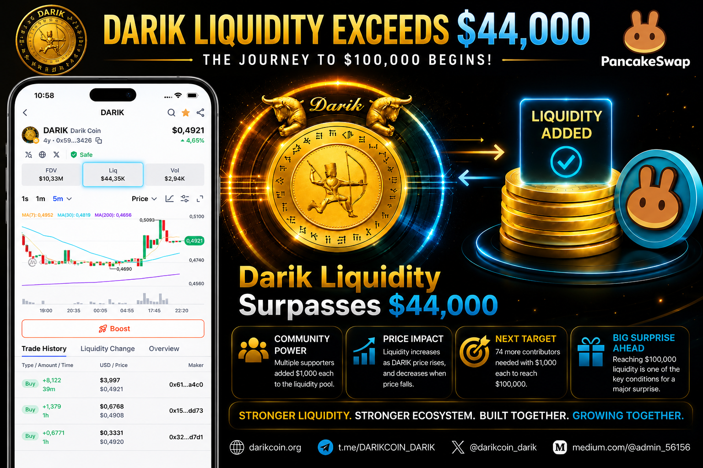
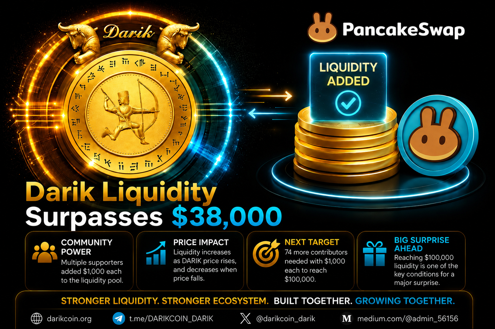

# Darik

Official repository for the Darik ecosystem.

## Official Links

Website
https://darikcoin.org

Whitepaper
https://darikcoin.org/DARIK_ECOSYSTEM_WHITEPAPER.pdf

CoinMarketCap
https://coinmarketcap.com/currencies/darik/

GitHub
https://github.com/darik-coin/Darik

Telegram
https://t.me/DARIKCOIN_DARIK

X (Twitter)
https://x.com/darikcoin_darik

Medium
https://medium.com/@admin_56156

Instagram
https://www.instagram.com/darikcoin.io

Reddit
https://www.reddit.com/r/DarikCoin/

---

## Latest News

### DARIK Liquidity Exceeds $44,000 — The Journey to $100,000 Begins

DARIK liquidity has officially surpassed $44,000, marking another important milestone for the ecosystem.

The next major target is $100,000 in liquidity.

Based on current calculations, 56 additional community members contributing approximately 500 USDT and 1,000 DARIK each can help achieve the next milestone.

Early participants may receive greater allocation and priority benefits than those who join later.

Once the liquidity pool reaches $100,000, the current allocation program will close and no further allocations under this initiative will be available.

A major surprise is planned when the $100,000 liquidity milestone is achieved.

Read the full article:

https://medium.com/@admin_56156/darik-liquidity-surpasses-44-000-the-journey-to-100-000-begins-8d89224e350d

---

### Darik Liquidity Surpasses $38,000 — A Special Milestone Awaits at $100,000

Darik liquidity has officially surpassed $38,000.

The next major target is $100,000 in liquidity. A special milestone awaits when this target is reached.

Early participants in liquidity growth may receive a greater allocation than those who join later.

Read the full article:

https://medium.com/@admin_56156/darik-liquidity-surpasses-38-000-a-special-milestone-awaits-at-100-000-abf4ea405c5b

### Darik Liquidity Surpasses $38,000 — A Special Milestone Awaits at $100,000

Darik liquidity has officially surpassed $38,000.

The next major target is $100,000 in liquidity. A special milestone awaits when this target is reached.

Early participants in liquidity growth may receive a greater allocation than those who join later.

Read the full article:

https://medium.com/@admin_56156/darik-liquidity-surpasses-38-000-a-special-milestone-awaits-at-100-000-abf4ea405c5b

---

### DARIK Built to Endure — High Risk Warning Removed from PancakeSwap

The High Risk warning previously displayed by third-party services is no longer shown on PancakeSwap.

Recent technical reviews confirmed that DARIK does not provide a centralized ownership structure capable of arbitrarily shutting down the ecosystem.

The project continues to move forward with a focus on transparency, decentralization, public verification, and long-term sustainability.

Read the full article:

https://medium.com/@admin_56156/darik-built-to-endure-high-risk-warning-removed-from-pancakeswap-b465cd30ffc3

---

## About

DARIK is a digital asset ecosystem focused on transparency, public verification, market-driven economics, and human-centered consensus mechanisms.

The ecosystem combines a publicly traded digital asset with the development of a human-centered blockchain infrastructure designed to support transparent participation, knowledge-based validation, and long-term ecosystem growth.

Key principles include:

* Decentralization
* Transparency
* Community participation
* Public verification
* Long-term sustainability

---

## Documentation

Official Whitepaper:

https://darikcoin.org/DARIK_ECOSYSTEM_WHITEPAPER.pdf

---

## Disclaimer

This repository is provided for informational and development purposes.

Users should independently verify all official links, contract addresses, market information, and technical documentation before interacting with any digital asset or related service.

Nothing contained in this repository should be interpreted as financial, investment, or legal advice.
